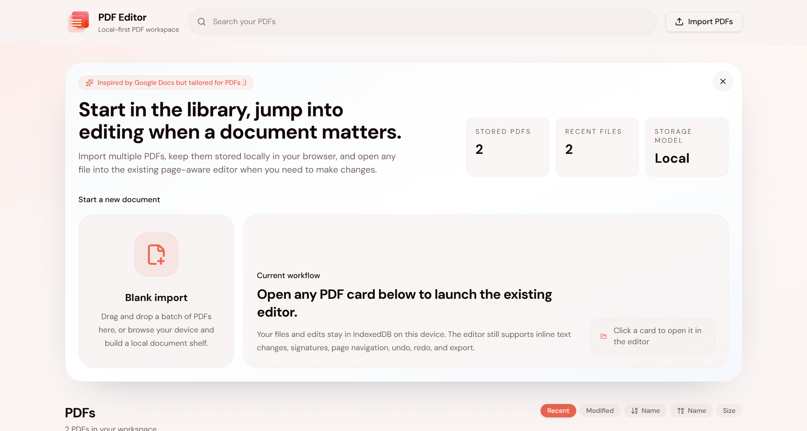
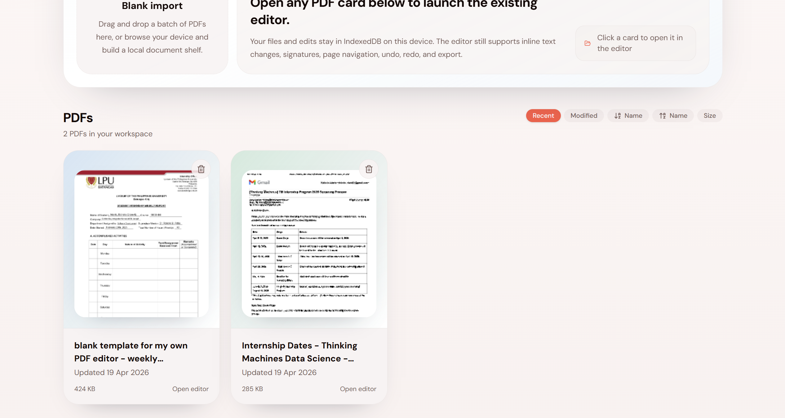
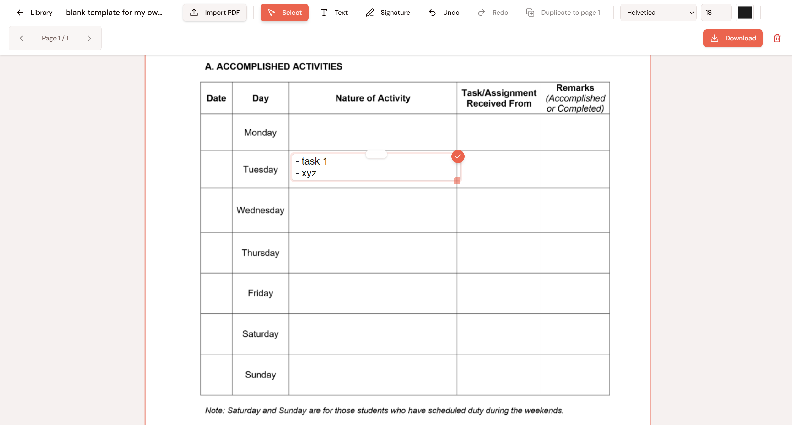

# Local-First PDF Editor

A browser-based PDF editor built with **React + Vite + Tailwind CSS** that allows users to upload, edit, and save PDFs directly on their device.

Visit the site here: https://pdf-editor-blush-three.vercel.app/

## Overview

This project is a **local-first web application**, meaning PDF data and edit state are stored in the browser with IndexedDB. Once a PDF is uploaded, it is automatically saved and restored when the user revisits the app without requiring a re-upload.

## Features

- Upload and render PDF files
- Add text and signatures
- Edit detected PDF text inline and bake those changes into exported PDFs
- Customize text (font size, font family, color)
- Drag and resize elements
- Undo and redo editing history
- Multi-page navigation with page-aware placement and duplication
- Fixed 100% page rendering for stable editor/export alignment
- Dark mode
- Automatic saving using IndexedDB
- Restore previous session on reload
- Installable Progressive Web App with offline asset caching
- Export edited PDF

## Tech Stack

- React (Vite)
- Tailwind CSS
- pdfjs-dist (PDF.js)
- pdf-lib
- IndexedDB
- vite-plugin-pwa

## Installation & Setup

1. Clone the repository:
git clone <https://github.com/richelleadarlo/pdf-editor.git>
cd pdf-editor

2. Install dependencies:
npm install

3. Start development server:
npm run dev

4. Open in browser:
http://localhost:5173

## Deploying To Vercel

This repository is now configured for static Vite deployment on Vercel.

1. Push this repo to GitHub.
2. In Vercel, import the GitHub repository.
3. Keep default values (the repository includes `vercel.json`):
  - Build command: `npm run build`
  - Output directory: `dist`
4. Deploy.

After that, every push to your connected branch (for example `main`) will automatically trigger a new Vercel deployment.

## Project Structure

src/
 ├── components/
 ├── hooks/
 ├── lib/
 ├── routes/
 ├── utils/
 ├── App.tsx
 ├── main.tsx

## How Persistence Works

- The uploaded PDF binary is stored in IndexedDB so larger files can survive browser refreshes.
- All edits (text, positions, styles, signatures, and original-text replacements) are stored separately and restored on load.

Example:

{
  "pdfFile": "base64string",
  "edits": [
    {
      "type": "text",
      "content": "Hello",
      "x": 100,
      "y": 200,
      "fontSize": 16,
      "fontFamily": "Arial",
      "color": "#000000",
      "page": 1
    }
  ]
}

- On page load, the app restores the previous session automatically.

## Key Concept: Local-First Behavior

Once a PDF is uploaded:
- It is saved entirely in browser storage
- All edits are auto-saved
- Reopening the bookmarked page restores everything instantly

## Exporting PDFs

- Uses pdf-lib to merge:
  - Original PDF
  - Text additions
  - Signature images
  - Rewritten detected text regions
- Outputs a downloadable edited PDF

## Limitations

- Direct original-text editing depends on text extraction from PDF.js. Complex embedded fonts, outlines, or scanned pages may still require manual overlays.
- Exported original-text edits are baked into the PDF by covering the detected region and redrawing replacement text. This is a practical client-side edit path, but it does not rewrite arbitrary low-level PDF content streams.

## Future Improvements

- Smarter font matching for original-text replacement
- OCR for scanned PDFs that do not expose selectable text
- Thumbnail previews for page navigation
- Better code splitting to reduce the main production bundle size

## Notes

- This app runs entirely on the client-side
- No backend or database is used
- Works offline after the initial visit once the PWA assets are cached

## Author

Developed by **Richelle Adarlo** as a modern, lightweight alternative to traditional PDF editors with a focus on privacy and offline usability.

---

Tip: Bookmark the app after uploading a PDF to experience its full local-first capability.